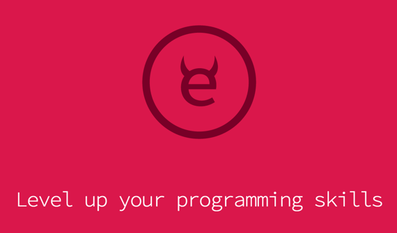

# My Exercism Ruby Solutions

I'm levelling up _my_ programming skills by taking on the little [Exercism](http://exercism.io) [Ruby challenges](http://exercism.io/languages/ruby/about). I'm saving them to this repo for posterity and so I can come back and reference them in future, just in case I come up with some über cool and amazing solution that I may want to refer back to.

If _you_ want to level up your programming skills, I highly recommend [Exercism](http://exercism.io), just don't look at my solutions until you've solved them for yourself.

## Notes to self

- Fetch: `exercism fetch`
- Pretty tests: `ruby -r minitest/pride *_test.rb`
- Force stylish code: `rubocop --config ../.rubocop.yml`
- Submit: `exercism submit <file>.rb`
